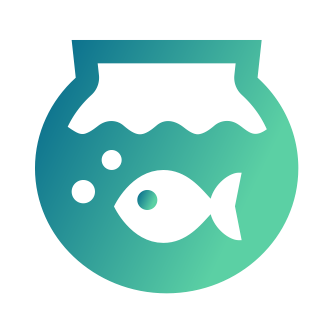
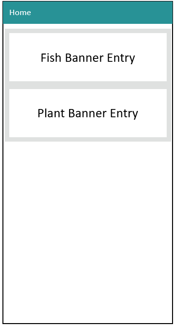
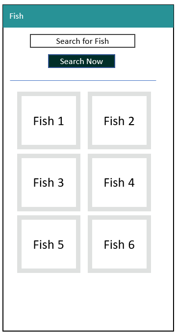
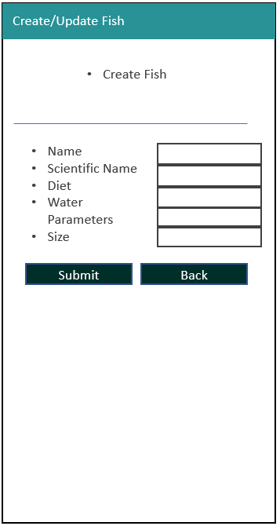

# Start of the aquarist's resource

#  Aquarist's Resource (Freshwater Ver.)

# 1. Background & Objective
## Background / Problem Statement
- In the world of fishkeeping and aquatic plant keeping, knowledge is often passed by word of mouth. Much of the information found on the web is contributed by hobbyist know-how. 

- As a passionate fish hobbyist myself, knowledge is crucial when it comes to keeping fish and plants alive in your planted tank; especially if you want a beautiful aquascape that mimics nature.

- The problem is that a lot of the information is scattered across long winded articles and in google search results, and there's no single source of information that can give you something bite-sized at a glance.

- This site will serve as a flexible data repository for anyone who wants to contribute new plant genuses/variations that have entered the aquarium trade, new fish that may have just come into your local live fish store (LFS) that you might have never seen before. Perhaps it came from the amazon river, and you have no clue what sort of water they like. 

- I hope here is where aquarists will find the information they need to keep their beloved tanks healthy and running.

## Objective
Design a website that collects information from hobbyists about fish and plants, and displays them to the aquarist community in a digestible/searchable manner for them to access and update the information.

Website has to be flexible and accept swathes of text information where required, so that write-ups on fish and plant care can be as detailed as required. 

Key Data points For Fish:
1. Fish Name
2. Scientific Name
3. Fish full-grown size (crucial for tank size planning)
4. Reproduction type
5. Diet
6. Water parameters - Temp, pH
7. Miscellaneous Tank setup tips

Key Data points For Aquatic Plants:
1. Plant Name
2. Scientific Name
3. Plant full-grown size (crucial for tank size planning)
4. Reproduction type
5. Water parameters - Temp, pH
6. Miscellaneous tank setup tips

There would be less data points for plants because all plants basically have the same diet. CO2, sunlight and nutrients from the soil/water column

## Purpose and Value to users

1. One stop to see all contributed fish and plants in one place
2. Immediately display existing fish/plants in repository in case user is just browsing
3. Users can correct entries if they feel that the information is lacking or misleading
4. User can contribute new fish if they want to, and share the website link to other users. 

<br>

# 2. Demo (Heroku)
Site is published via Heroku and can be viewed [here](https://aquarist-resource.herokuapp.com/)

<br>

# 3. Technologies Used
- HTML
- CSS
- Bootstrap 4
- Jinja2 web template engine
- Python
- Flask framework
- MongoDB

## 3.1 Dependencies installed with pip (python's package manager)
- flask
- pymongo
- dnspython
- python-dotenv

<br>

# 4. The Goals: User Stories or (JTBD) Jobs-to-be-Done

For the freshwater aquarist in search of crowdsourced know-how:

```
1. I want to be able to search a fish or plant by name, rather than go article by article in a google search
2. I want to be able to view all fish/plants at a glance, and browse the pages for my enjoyment/learning
3. I want to be able to contribute my own knowledge about a fish/plant to the repository
    - The repository should provide some validation and formatting, especially when it comes to things like fish size, diet, water pH and temperature
    - At the same time, I should be allowed to input as much free text as required to ensure that I can impart my guidance to others in the aquarist community.
4. I want to be able to update/delete entries that might be fraudulent or fake
5. The site should be mobile responsive so that I can share it on the go with fellow hobbyists.
```
<br>

# 5. Key Features
- Homepage to redirect to Fish or Plant repository
- Local storage using javascript to remember previous pokemon choices and store them in 6 slots
- Auto-complete dropdown to help with users who might not know how to spell the full pokemon name in the search bar
- Form submit, information display and information storage in Local Storage
- Display of pokemon details via HTML and CSS manipulation and DOM traversal

## 5.1 Feature List
|# | Name          | Description   |     
| -| ------------- |-------------|
|1 | Search Bar for Fish or Plants |Entering partial string returns all instances of matching characters| 
|2 | Landing Page to display fish/plants that are stored| Display fish/plants documents in mongoDB fish/plant collection| 
|3 | Navigation Bar |  Simple Nav-bar that points to both fish and plants landing page     | 
|4 | Create Fish/Plants Form | Form for user to input information to be stored as key-value pairs in mongoDB | 
|5 | Delete Fish/Plants Form | Option to delete fish/plants document using ObjectID as identifier in mongoDB collection | 
|6 | Update Fish/Plants Form | Update existing values of fish/plants collection's document using ObjectID to extract from mongoDB and store new values |
|7 | Form Validations | Prevent empty values, nonsense values (e.g. negative size of fish) |
<br>

# 6. Prototyping
Simple Prototyping was done directly using MS Powerpoint to mock-up the features of the website.

## 6.1 Front-End UI Mock-up





Reference was taken from
- [Checkout form example](https://getbootstrap.com/docs/4.0/examples/checkout/) from Bootstrap 4

## 6.2 Actual Final Design
The final design aims to provide a solution to all user stories listed in `section 4 The Goals: User Stories or (JTBD) Jobs-to-be-Done` 

### 6.2.1 Search Section


```
1. I want to be able to search a fish or plant by name, rather than go article by article in a google search
```

### 6.2.2 Display Fish/Plant Section


```
2. I want to be able to view all fish/plants at a glance, and browse the pages for my enjoyment/learning
```

## 6.3 Colour
#
```
For the green: #289296
```
<br>

# 7. Detailed Features Write-up
## 7.1 Search Bar
- Implemnted using `$regex` mongo query to obtain matching
- option `i` was used to make query insensitive to letter casing

## 7.1.1 Search Bar Validation
- simple if function to prevent empty string from being processed

## 7.2 Fish/Plant display
-  use mongo query to display based on text entered into search bar

## 7.3 Pagination of Fish/Plant display
- Pagination was handled by applying the condition of `skip()` and `limit()` into the query criteria when calling the `show_all_fish` function.
- `page` value was passed using `GET` method from front end
- if no `page` value exists, return `0` so that 1st page is displayed.

Sample logic:
```
fish = db.fish.find(criteria).skip(page*12).limit(12)
```

## 7.3.1 `Next` and `Previous` `Page` Button handling
- counted `number of pages` based on `count of collection documents` / preferred number of fish per page (12 in this case) to arrive at `last page`

```

    
        <a href="?page={{page+1}}" class="btn btn-secondary my-3 col-auto mx-0 text-center">Next Page</a>
    

```

## 7.4 Create Fish/Plant Entry
- used a separate route to display `fish_create` form
- another sepaparate route was used to process the `fish_create form
- `methods=["POST"]` was used to obtain parameters from front-end

### 7.4.1 Validation of inputs for Create Fish form
List of validation logics used: 
```
    errors = {}

    if len(name) == 0:
        errors['name_is_blank'] = "Fish name cannot be blank"

    if len(scientific_name) == 0:
        errors['scientific_name_is_blank'] = "Scientific name cannot be blank"

    if len(fish_picture) == 0:
        errors['fish_picture_is_blank'] = "No fish pic URL was found"

    if len(full_grown_size_in_cm) == 0:
        errors['full_grown_size_is_blank'] = "No fish size was entered"
    elif float(full_grown_size_in_cm) < 0:
        errors['full_grown_size_is_negative'] = "Fish Size cannot be negative"

    if len(reproduction) == 0:
        errors['reproduction_is_blank'] = "No reproduction method was entered"

    if len(water_temp_in_degc) == 0:
        errors['water_temp_is_blank'] = "No water temperature was entered"
    elif float(water_temp_in_degc) < 0:
        errors['water_temp_is_negative'] = "Water Temp cannot be negative"

    if len(pH) == 0:
        errors['pH_is_blank'] = "pH cannot be blank"
    elif float(pH) < 0:
        errors['pH_is_negative'] = "pH cannot be negative"

    if len(pH) == 0:
        errors['tank_setup_text_is_blank'] = "No tank setup text was entered"
```
### 7.4.2 Handling errors in front end for create entry form
- if errors are found, overwrite the existing field with `old values` so that users can see which fields were filled wrongly

### 7.4.3 Error messages display using `flash` in `base.template.html`
```

        
        <div class="alert alert-success my-0">
            
            <p>{{m}}</p>
            
        </div>
        
        

        
        
```

### 7.5 Deleting fish/plant document


# 8. Bootstrap 4 Implementation
- Bootstrap 4 was used for re-building the website in a responsive, mobile-first manner. You can access Boostrap 4 resouces [here](https://getbootstrap.com/docs/4.5/getting-started/introduction/)

The below `code snippets` were added to HTML `<head>`

- For CSS
```
- <link rel="stylesheet" href="https://cdn.jsdelivr.net/npm/bootstrap@4.5.3/dist/css/bootstrap.min.css" integrity="sha384-TX8t27EcRE3e/ihU7zmQxVncDAy5uIKz4rEkgIXeMed4M0jlfIDPvg6uqKI2xXr2" crossorigin="anonymous">

- <script src="https://cdn.jsdelivr.net/npm/bootstrap@4.5.3/dist/js/bootstrap.bundle.min.js" integrity="sha384-ho+j7jyWK8fNQe+A12Hb8AhRq26LrZ/JpcUGGOn+Y7RsweNrtN/tE3MoK7ZeZDyx" crossorigin="anonymous"></script>
```

<br>

# 10. Content Credits
## Images of pokemon

## 

<br>

# 11. Fonts
Font was implemented using google fonts. In order to mimic the robotic nature of the pokedex, all text related to the pokedex "speaking" was using `Roboto Mono`. Other text is rendered using `Monserrat`

```

```

<br>

# 12. Testing
## 12.1 Code Validation using Code Validators
- `style.css` was validated using the W3C Jigsaw validator ([Link](https://jigsaw.w3.org/css-validator/validator))
  - No issues were found with `style.css`
- `script.js` was validated using JShint ([Link](https://jshint.com/))
  -  The following configurations were included in JShint:
  - 
  - No issues were found with `New Javascript features (ES6)` and `jQuery` checked in the configuration list
  
- `index.html` was validated using the W3 Nu HTML Validator ([Link](https://validator.w3.org/nu/#file))
  - It was found that `<section>` tags and `label`/`placeholder` attributes were wrongly used.
  - Code was changed to remove erroneous tags and attributes. Replaced these tags with `<div>` and `<p>` to render content instead.
  - Post code fix Response from Nu Html Checker: `"Document checking completed. No errors or warnings to show."`

## 12.2 Testing and Bug Fixes (Test Case Table)

| # |Type| Test       | Result           | Fix/Expected Result  |
|-- |--|------------- |:-------------:| -----:|
|1  |Functionality|Pokedex search is supposed to autocomplete all pokemon | Display entire list of pokemon from pokeAPI | not able to display dropdown. Discovered that it's due to the script linking at the bottom of HTML body. Loading JQuery script last solved the issue |
|2  |Usability| Enter unlisted pokemon name into pokedex search | No response | Added validation to alert user if they enter a non-existing pokemon name |
|3  |Usability| Display of Name | Pokemon names were uncapitalised|Added code handling to ensure that first letter of pokemon name is capitalised |
|4  |Functionality| Display of pokemon type | If pokemon has 2 types, only one was showing. Expected result is to show both when both are available | Added handling. If pokemon has a 2nd type, display 2nd type. if not then only show one type (if pokemon is a pure typing)
|5  |Functionality| Display of pokemon stats | Pokemon Stats should scale according to the progressbar widget, but all values of pokemon stats above value 100 resulted in all bars being full for some pokemon. The difference between the 6 stats was lost | Added scaling. pokemon stats were divided by 20 and then multiplied by 100 again. Progress bars now only max out at 200 and above
|6  |Functionality| Moveset display | Can choose and display as many moves from autocomplete movebar | All Ok
|7  |Usability| Moveset duplicate | Found that same move can be selected. Should not be the case as pokemon cannot have duplicated moves | Should only show one move once in the selected displayed move. Added alert to handle if the same move is selected|
|8  |Functionality| Adding of proview pokemon in to 6 slots | Pokemon were able to be successfull stored in local storage. local storage items were found to exist, and retrieval of pokemon Name had no problems| All ok|
|9  |Functionality| Overwriting pokemon in slot | If pokemon has already be saved in slot X, attempt to override the pokemon in slot X with another pokemon | All Ok|
|10 |Functionality| Refresh page to check if pokemon saved stay in slot | Pokemon stayed in page because of getpokemon function at beginning of script.js | All Ok|
|11 |Functionality| Pokemon move permanence and transfer | Selected moves from preview pokemon were to be stored and transferred to the save slots | All Ok |
|12 |Usability| Clear Move button | The clear move button cleared the moves for the specific pokemon and removed the element from the html DOM| All OK|
|13 |Responsiveness| Test screen size | Tested using Firefox to mock iPhone X, Samsung S9| Save slot buttons were not sizing properly. Edited code to allow bootstrap 4 grid system to apply without buttons overflowing to the next row|
|14 |Responsiveness|Test navbar toggle responsiveness | Navbar toggle disappears when changing to Samsung S9 and iphone instead of `responsive`| It was found that the pokeball images used as placeholders were exceeding the viewport size and pushing the navbar toggle off the viewport. Code changes were added to constrict pokeball placeholder images to 70X70px |
|15 |Usability| Autocomplete seach bar to handle auto capitalization of mobile phone keyboards | Did not handle. API was not called due to capitalization of first character | Double layer of handling added: first toLowerCase() was used when calling API to prevent errors. Capitalization was added to autocomplete to ensure that Capital letters triggle dropdown in autocomplete bar|
|16 |Responsiveness| images in the save slots were not centred | Suppose to be centred. |applied bootstrap class `"mx-auto"` in order to center the element|

<br>

# 14. Deployment
## 14.1 Preparation
Before the site goes `live` the following elements are checked via Visual Studio Code's `Live Server` extension:
- Fulfillment of Learning objectives from 'Code Insitutes' Assessment Handbook`
- Check all code linters and validators are clear
- Check that all images src are not broken
- Test viewport dynamic resizing for android (Samsung S9) and iOS (iPhone X/XS)
- Check Preview pokemon feature
- Ensure all elements of the preview pokemon are displayed, including sprites and type icons
- Check Movelist for preview pokemon
- Check movelist double entry alert
- Check Saving function and saving function alert message
- Check all 6 slots can be saved
- Ensure all elements of the Saved pokemon are displayed, including sprites and type icons
- Check Movelist for all 6 pokemon

## 14.2 Deployment Steps
Deployment was done via github pages.

After ensuring that final commit and push via Visual Studio Code was done

1. Check if the contents have been successfully pushed to repository at https://github.com/Malrhis/Project-2-codeinstitute
2. Verify that site has been published to github pages via settings section of the repository ([Link](https://github.com/Malrhis/Project-2-codeinstitute/settings))
3. Click on [Published URL](https://malrhis.github.io/Project-2-codeinstitute/)
4. perform another round of validation based on `#14.1 Preparation` but this time in github pages instead of liveserver

## 14.3 Production
In the event that `#14.1` and `#14.2` are cleared, the site can then be considered to be in production. 
If not, repeat to ensure that deploying of code is error free and is working in Github pages.

<br>

# 15. Acknowledgements
- Mr Malcolm Yam - Bootrap, Javascript and Jquery instructor
- Mr Arif Rawi - HTML and CSS instructor
- Mr Paul Kunxin Chor - Who guided us on logics for Javascript
- Mr Shun - Teaching assistant, who supported this project by holding consultation sessions

```

## Setup
1. Create a new file named '.env'
2. Put inside '.env' the following:

```
MONGO_URI = connectionstringfrommongoatlas
```

3. Create a mongo client:
```
DB_NAME = 'sample_airbnb'
client = pymongo.MongoClient(MONGO_URI)