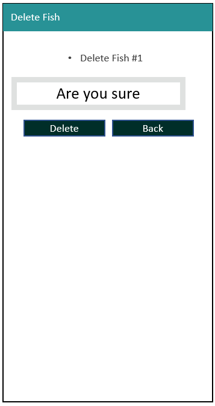

# Start of the aquarist's resource

#  Aquarist's Resource (Freshwater Ver.)

# 1. Background & Objective
## Background / Problem Statement
- In the world of fishkeeping and aquatic plant keeping, knowledge is often passed by word of mouth. Much of the information found on the web is contributed by hobbyist know-how. 

- As a passionate fish hobbyist myself, knowledge is crucial when it comes to keeping fish and plants alive in your planted tank; especially if you want a beautiful aquascape that mimics nature.

- The problem is that a lot of the information is scattered across long winded articles and in google search results, and there's no single source of information that can give you something bite-sized at a glance.

- This site will serve as a flexible data repository for anyone who wants to contribute new plant genuses/variations that have entered the aquarium trade, new fish that may have just come into your local live fish store (LFS) that you might have never seen before. Perhaps it came from the amazon river, and you have no clue what sort of water they like. 

- I hope here is where aquarists will find the information they need to keep their beloved tanks healthy and running.

## Objective
Design a website that collects information from hobbyists about fish and plants, and displays them to the aquarist community in a digestible/searchable manner for them to access and update the information.

Website has to be flexible and accept swathes of text information where required, so that write-ups on fish and plant care can be as detailed as required. 

Key Data points For Fish:
1. Fish Name
2. Scientific Name
3. Fish full-grown size (crucial for tank size planning)
4. Reproduction type
5. Diet
6. Water parameters - Temp, pH
7. Miscellaneous Tank setup tips

Key Data points For Aquatic Plants:
1. Plant Name
2. Scientific Name
3. Plant full-grown size (crucial for tank size planning)
4. Reproduction type
5. Water parameters - Temp, pH
6. Miscellaneous tank setup tips

There would be less data points for plants because all plants basically have the same diet. CO2, sunlight and nutrients from the soil/water column

## Purpose and Value to users

1. One stop to see all contributed fish and plants in one place
2. Immediately display existing fish/plants in repository in case user is just browsing
3. Users can correct entries if they feel that the information is lacking or misleading
4. User can contribute new fish if they want to, and share the website link to other users. 

<br>

# 2. Demo (Heroku)
Site is published via Heroku and can be viewed [here](https://aquarist-resource.herokuapp.com/)

<br>

# 3. Technologies Used
- HTML
- CSS
- Bootstrap 4
- Jinja2 web template engine
- Python
- Flask framework
- MongoDB

## 3.1 Dependencies installed with pip (python's package manager)
- flask
- pymongo
- dnspython
- python-dotenv

## 3.2 Python Libraries used
```
from flask import Flask, render_template, request, redirect, url_for
from flask import flash, send_from_directory
import os
import pymongo
import math
from dotenv import load_dotenv
from bson.objectid import ObjectId
```

<br>

# 4. The Goals: User Stories or (JTBD) Jobs-to-be-Done

For the freshwater aquarist in search of crowdsourced know-how:

```
1. I want to be able to search a fish or plant by name, rather than go article by article in a google search
2. I want to be able to view all fish/plants at a glance, and browse the pages for my enjoyment/learning
3. I want to be able to contribute my own knowledge about a fish/plant to the repository
    - The repository should provide some validation and formatting, especially when it comes to things like fish size, diet, water pH and temperature
    - At the same time, I should be allowed to input as much free text as required to ensure that I can impart my guidance to others in the aquarist community.
4. I want to be able to update/delete entries that might be fraudulent or fake
5. The site should be mobile responsive so that I can share it on the go with fellow hobbyists.
```
<br>

# 5. Key Features
- Homepage to redirect to Fish or Plant repository
- Local storage using javascript to remember previous pokemon choices and store them in 6 slots
- Auto-complete dropdown to help with users who might not know how to spell the full pokemon name in the search bar
- Form submit, information display and information storage in Local Storage
- Display of pokemon details via HTML and CSS manipulation and DOM traversal

## 5.1 Feature List
|# | Name          | Description   |     
| -| ------------- |-------------|
|1 | Search Bar for Fish or Plants |Entering partial string returns all instances of matching characters| 
|2 | Landing Page to display fish/plants that are stored| Display fish/plants documents in mongoDB fish/plant collection| 
|3 | Navigation Bar |  Simple Nav-bar that points to both fish and plants landing page     | 
|4 | Create Fish/Plants Form | Form for user to input information to be stored as key-value pairs in mongoDB | 
|5 | Delete Fish/Plants Form | Option to delete fish/plants document using ObjectID as identifier in mongoDB collection | 
|6 | Update Fish/Plants Form | Update existing values of fish/plants collection's document using ObjectID to extract from mongoDB and store new values |
|7 | Form Validations | Prevent empty values, nonsense values (e.g. negative size of fish) |
<br>

# 6. Prototyping
Simple Prototyping was done directly using MS Powerpoint to mock-up the features of the website.

## 6.1 Front-End UI Mock-up




Reference was taken from
- [Checkout form example](https://getbootstrap.com/docs/4.0/examples/checkout/) from Bootstrap 4

## 6.2 Actual Final Design
The final design aims to provide a solution to all user stories listed in `section 4 The Goals: User Stories or (JTBD) Jobs-to-be-Done` 

### 6.2.1 Search Section


```
1. I want to be able to search a fish or plant by name, rather than go article by article in a google search
```

### 6.2.2 Display Fish/Plant Section


```
2. I want to be able to view all fish/plants at a glance, and browse the pages for my enjoyment/learning
```

## 6.3 Colour
#
```
For the green colour: #289296
```
<br>

# 7. Detailed Features Write-up
## 7.1 Search Bar
- Implemnted using `$regex` mongo query to obtain matching
- option `i` was used to make query insensitive to letter casing

## 7.1.1 Search Bar Validation
- simple if function to prevent empty string from being processed

## 7.2 Fish/Plant display
-  use mongo query to display based on text entered into search bar

## 7.3 Pagination of Fish/Plant display
- Pagination was handled by applying the condition of `skip()` and `limit()` into the query criteria when calling the `show_all_fish` function.
- `page` value was passed using `GET` method from front end
- if no `page` value exists, return `0` so that 1st page is displayed.

Sample logic:
```
fish = db.fish.find(criteria).skip(page*12).limit(12)
```

## 7.3.1 `Next` and `Previous` `Page` Button handling
- counted `number of pages` based on `count of collection documents` / preferred number of fish per page (12 in this case) to arrive at `last page`

```

    
        <a href="?page={{page+1}}" class="btn btn-secondary my-3 col-auto mx-0 text-center">Next Page</a>
    

```

## 7.4 Create Fish/Plant Entry
- used a separate route to display `fish_create` form
- another sepaparate route was used to process the `fish_create form
- `methods=["POST"]` was used to obtain parameters from front-end

### 7.4.1 Validation of inputs for Create Fish form
List of validation logics used: 
```
    errors = {}

    if len(name) == 0:
        errors['name_is_blank'] = "Fish name cannot be blank"

    if len(scientific_name) == 0:
        errors['scientific_name_is_blank'] = "Scientific name cannot be blank"

    if len(fish_picture) == 0:
        errors['fish_picture_is_blank'] = "No fish pic URL was found"

    if len(full_grown_size_in_cm) == 0:
        errors['full_grown_size_is_blank'] = "No fish size was entered"
    elif float(full_grown_size_in_cm) < 0:
        errors['full_grown_size_is_negative'] = "Fish Size cannot be negative"

    if len(reproduction) == 0:
        errors['reproduction_is_blank'] = "No reproduction method was entered"

    if len(water_temp_in_degc) == 0:
        errors['water_temp_is_blank'] = "No water temperature was entered"
    elif float(water_temp_in_degc) < 0:
        errors['water_temp_is_negative'] = "Water Temp cannot be negative"

    if len(pH) == 0:
        errors['pH_is_blank'] = "pH cannot be blank"
    elif float(pH) < 0:
        errors['pH_is_negative'] = "pH cannot be negative"

    if len(pH) == 0:
        errors['tank_setup_text_is_blank'] = "No tank setup text was entered"
```
### 7.4.2 Handling errors in front end for create entry form
- if errors are found, overwrite the existing field with `old values` so that users can see which fields were filled wrongly

### 7.4.3 Error messages display using `flash` in `base.template.html`
```

        
        <div class="alert alert-success my-0">
            
            <p>{{m}}</p>
            
        </div>
        
        

        
        
```

## 7.5 Deleting fish/plant document
* one route to view the delete form
* another route to process the removal of the document
* `'_id': ObjectId(fish_id)` was used to determine the specific document to be deleted
* flash message was used to notify delete success
    * `flash("Fish has been deleted successfully!")

## 7.6 Updating fish/plant document
* one route to view the update form
* another route to process new `key-value` pairs being passed to `mongoDB`

### 7.6.1 Update process validation
- Validation was done similar to checks used in `7.4.1`

### 7.6.2 Combining `old values` and `error values` when returning errors to `update form` in front end
```
# merge both:
# retrieve from fish_to_update and replace with request.form
# request.form will have priority over old values

old_values = {**fish_to_update, **request.form}
```
7.7 Plants and Fish different collection handling
- fish are stored in `fish` collection in mongoDB
- plants are stored in `plant` collection in mongoDB
- `@app.route` used for `fish` are repeated for `plants`
- Jinja2 templates are re-created for `plants`

# 8. Bootstrap 4 Implementation
- Bootstrap 4 was used for re-building the website in a responsive, mobile-first manner. You can access Boostrap 4 resouces [here](https://getbootstrap.com/docs/4.5/getting-started/introduction/)

The below `code snippets` were added to the HTML in `base.template.html` to invoke the boostrap framework
```
<link href="https://cdn.jsdelivr.net/npm/bootstrap@5.0.0-beta2/dist/css/bootstrap.min.css" rel="stylesheet" integrity="sha384-BmbxuPwQa2lc/FVzBcNJ7UAyJxM6wuqIj61tLrc4wSX0szH/Ev+nYRRuWlolflfl" crossorigin="anonymous">

<script src="https://code.jquery.com/jquery-3.4.1.slim.min.js" integrity="sha384-J6qa4849blE2+poT4WnyKhv5vZF5SrPo0iEjwBvKU7imGFAV0wwj1yYfoRSJoZ+n" crossorigin="anonymous"></script>

<script src="https://cdn.jsdelivr.net/npm/popper.js@1.16.0/dist/umd/popper.min.js" integrity="sha384-Q6E9RHvbIyZFJoft+2mJbHaEWldlvI9IOYy5n3zV9zzTtmI3UksdQRVvoxMfooAo" crossorigin="anonymous"></script>

<script src="https://stackpath.bootstrapcdn.com/bootstrap/4.4.1/js/bootstrap.min.js" integrity="sha384-wfSDF2E50Y2D1uUdj0O3uMBJnjuUD4Ih7YwaYd1iqfktj0Uod8GCExl3Og8ifwB6" crossorigin="anonymous"></script>
```

<br>

# 9. Environment setup

## 9.1
The following were used in the .env file
```
MONGO_URI
SECRET_KEY
```

MONGO_URI is to enable connection to mongoDB
SECRET_KEY is used to enable `flash` messages

# 10. Content Credits
## Fish content, writeups, actual water parameters
- https://www.seriouslyfish.com/

## Images
- https://unsplash.com/


<br>

# 11. Non-relational Data Model Design of Fish and Plants Collection
Fish and plants collections are stored in mongoDB. Each document will essentially carry all the information required so that front end can render a card for each plant or fish

## 11.1 Non-relational database design philosophy:
1. Should encompass enough information about each fish and plant to allow users to find the information useful for their hobby
2. Front-end should display each document of fish or plant as a card
3. Card should have images
4. Images can be provided and stored as a string of text which in turn can be used as HTML `href`
5. Field related to numerical values has to have validation and checks: for instance: `Water's pH` cannot be negative: it has to be a `float` that is postiive
6. Field with restricted options should be restricted on the front end and stored as sting in the backend.
7. Determining of whether information is sufficient or not will draw on my personal knowledge of fish-keeping and aquascaping.

Sample of Fish DB (Plant DB will be similar)
```
    _id :6054af0dc135e8fe313bca7b
    name:"Betta Macrostoma"
    scientific_name:"Betta Macrostoma"
    higher_classification:"Betta"
    fish_picture :"https://tankaddict.com/wp-content/uploads/betta-macrostoma.jpg"
    full_grown_size_in_cm:"10.0"
    reproduction:"Paternal Mouthbrooder"
    diet:"Carnivore"
    water_temp_in_degc:"25.0"
    pH:"6.0"
    tank_setup_text:"Can be maintained in a fully-decorated aquarium although many breeders..."

```
## 11.2 Input types for html
- Chosen based on logicality of the value required to be stored.
    - for instance: `Water's pH` cannot be negative: it has to be a `float` that is postiive
- If only a few options are available, fix the options via `dropdown` `select`
    - Diet: Carnivore, Herbivore, Omnivore

## 11.3 Importance of water parameters as data points
- the crux of all aquarium keeping is the water quality. 
- hence each card should have a separate section specially for water quality
```
water_temp_in_degc:"25.0"
pH:"6.0"
```

## 11.4 Importance of anecdotal evidence stored as string/text
```
tank_setup_text:"Can be maintained in a fully-decorated aquarium although many breeders..."
```
Much of the key information about fish-keeping and plant keeping is rooted in word of mouth. One of the key-value pairs has to be dedicated to allowing users to add as much text as possible to guide others to successful fish-keeping

<br>

# 12. Testing
## 12.1 Code Validation using Code Validators
- `style.css` was validated using the W3C Jigsaw validator ([Link](https://jigsaw.w3.org/css-validator/validator))
  - No issues were found with `style.css`
  
- all `.html` files in `templates` was validated using the W3 Nu HTML Validator ([Link](https://validator.w3.org/nu/#file))
  - Many of the `Jinja2` syntax were picked up as errors
  - In order to handle this, each flag was picked out to check if it was truly related to `Jinja2` or was an actual error
  - Post code fix Response from Nu Html Checker: `"Document checking completed. No errors or warnings to show."`

## 12.2 PEP8 Style guide for Python
All code in `app.py` complies with `PEP8` [Style guide](https://www.python.org/dev/peps/pep-0008/) 

This is ensured by making sure no callouts from gitpod python linter are present in `app.py` and that no lines of code in `app.py` exceed 79 Characters

## 12.2 Testing and Bug Fixes (Test Case Table)

| # |Type| Test       | Result           | Fix/Expected Result  |
|-- |--|------------- |:-------------:| -----:|
|1  |Functionality| Search bar is supposed to display fish based on string entered | Displayed list fish that match the string | All OK |
|2  |Usability| Enter random string of text which doesn't match into search bar | returns no fish/plants | All OK |
|3  |Functionality| Display of all fields from mongo onto card in `show_all_fish` and `show_all_plants` | Show all fields from mongoDB in front end | Did not return `diet` element in `fish` template. was found that a wrong parameter was used (`plant` was used instead of `fish` and since plants don't have diets, front end was not displaying properly)
|5  |Functionality| Validation of empty input for `create` & `update` | flash message to alert user that input during `create` and `update` cannot be empty | All OK
|6  |Functionality| When error values are entered in `update`, supposed to merge `old values` and `error values` + display `flash` message so user knows which error occurred during validation and can edit their error | Only `old values` were showing | typo in `old values` and `error values` syntax. Was fixed quickly and now All OK
|7  |Usability| Page buttons should only show `next page` in the first to 2nd last page. should not show in last page. `Previous page` should only show in 2nd to last page | Button order did not work properly, and `next page` was shown in the last page even though there are no more documents to be displayed | created new variable to store `last_page` value. If `page != last page` then display `next button`. All OK now
|8  |Usability| style.css colour should be turquoise as that is the theme for the website | was stuck in black colour | Attempted to fix by moving file tree for `static`. Was found that `style.css` was being overwritted by the bootstrap class `navbar-dark`. Removed the class and the static file was synching |
|9  |Usability| favicon should be displayed | favicon could not be displayed | Attempted bugfix using different `url for` syntax. Was fixed by clearing cache using `ctrl + f5` |
|10 |Functionality| Delete document  | Document should be gone from fish/plant collection in mongo and on refresh, should not show in `show_all_fish` / `show_all_plants` | All Ok|
|11 |Functionality| url routing using `url_for` | navigate all links on navbar and site to ensure navigation are not broken | Navigation All Ok |
|12 |Responsiveness| Test screen size | Tested using Firefox to mock iPhone X, Samsung S9| Was found that cards were not `fluid` type. changed all cards to `fluid` so that they look better on mobile |
|13 |Functionality & Responsiveness| Deployment test to heroku | clicked on heroku link in mobile phone and tested if pages were working correctly and responsively | All Ok |
|14 |Usability| Browser Tab name should be correct | Found that browser tab name for plants create form was still named as fish create form | Changed  Jinja2 block and now All OK|
|15 |Usability| Could not click button to go back from create fish and create plant form | No back button | Added back button in create fish template |

<br>

# 14. Deployment

# 14.0 set `debug=False`!!! since we are going into production and no longer in development

## 14.1 Preparation
Before the site goes `live` the following elements are checked gitpod's native browser preview via open port `8080`. This is done by executing command in terminal `python3 app.py` to run the `flask app` in `app.py`
- Fulfillment of Learning objectives from 'Code Insitutes' Assessment Handbook`
- Check all code linters and validators are clear
- Check that all images src are not broken
- Test viewport dynamic resizing for android (Samsung S9) and iOS (iPhone X/XS)
- Check Create, Read, Display, Update, Delete functions from Fish to Plant
- Ensure all elements of the fish or plant are displayed, including images rendered from `picture html url string` key-value pair stored in mongoDB document
- Check navbar functionality and responsiveness
- Check pagination is working for `show_all_fish` and `show_all_plants`

## 14.2 Deployment Steps to Github
Deployment was done via github pages.

After ensuring that final commit and push via Visual Studio Code was done

1. Check if the contents have been successfully pushed to repository at https://github.com/Malrhis/project3

## 14.3 Deployment to Heroku
1. Login to `heroku` on terminal using `heroku login -i`
2. Check `remotes` using `git remote -v`
3. Ensure that `requirements.txt` is updated correctly
4. perform `git push heroku master`
5. Setup environment variables in heroku as follows
```
heroku config:set MONGO_URI= XXX
```
6. Check that environment variables can be seen in heroku app settings under `config vars`
5. Verify that site has been published to Heroku dashboard in Heroku ([Link](https://dashboard.heroku.com/apps/aquarist-resource))
7. Click on [Published URL](https://aquarist-resource.herokuapp.com/)
8. perform another round of validation based on `#14.1 Preparation` but this time in `heroku` instead of `gitpod browser preview`

## 14.3 Production
In the event that `#14.1`, `#14.2` & `#14.3`  are cleared, the site can then be considered to be in production. 
If not, repeat to ensure that deploying of code is error free and is working in `Github repo` and `heroku`.

<br>

# 15. Acknowledgements
- Mr Malcolm Yam - Bootrap instructor
- Mr Arif Rawi - HTML and CSS instructor
- Mr Paul Kunxin Chor - Who guided us on python, Jinja2, flask, mongo, pymongo
- Mr Ace Liang - Teaching assistant, who supported this project by holding consultation sessions.